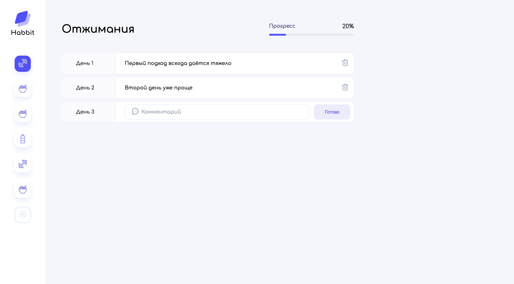

# Habbits App

Приложение для учета привычек и прогресса их выполнения.

Демо - https://purpleschool-js-basics-habbits-tracker.vercel.app

### Функционал

- Пользователи могут добавлять привычки;
- Пользователи могут указывать сколько дней нужно на закрепление привычек;
- Пользователи могут оставлять комментарии для каждого дня выполнения привычки;
- Все данные хранятся в localStorage.

Подробности в [документации](docs/README.md).

### Предварительные требования

Для запуска приложения требуется **Docker** и **Docker Compose**.

### Основные команды

| Команда                | Описание                        |
|:-----------------------|:--------------------------------|
| `make init`            | Инициализация приложения        |
| `make up`              | Запуск приложения               |
| `make down`            | Остановка приложения            |

### Интерфейсы

Приложение - http://localhost:8080

---

Код написан в образовательных целях в рамках курса [JavaScript с нуля - основы языка и практика для начинающих](https://purpleschool.ru/course/javascript-basics).
