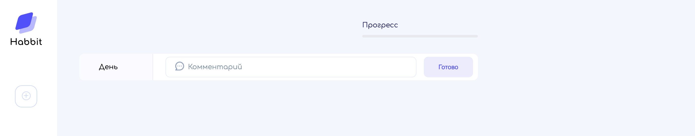
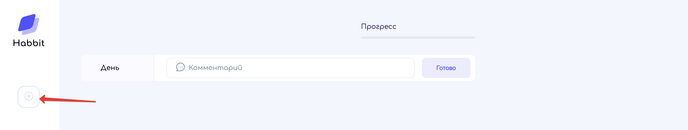
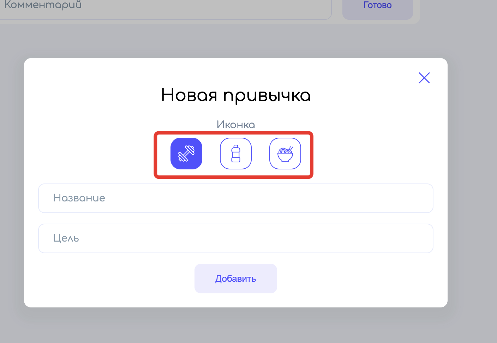
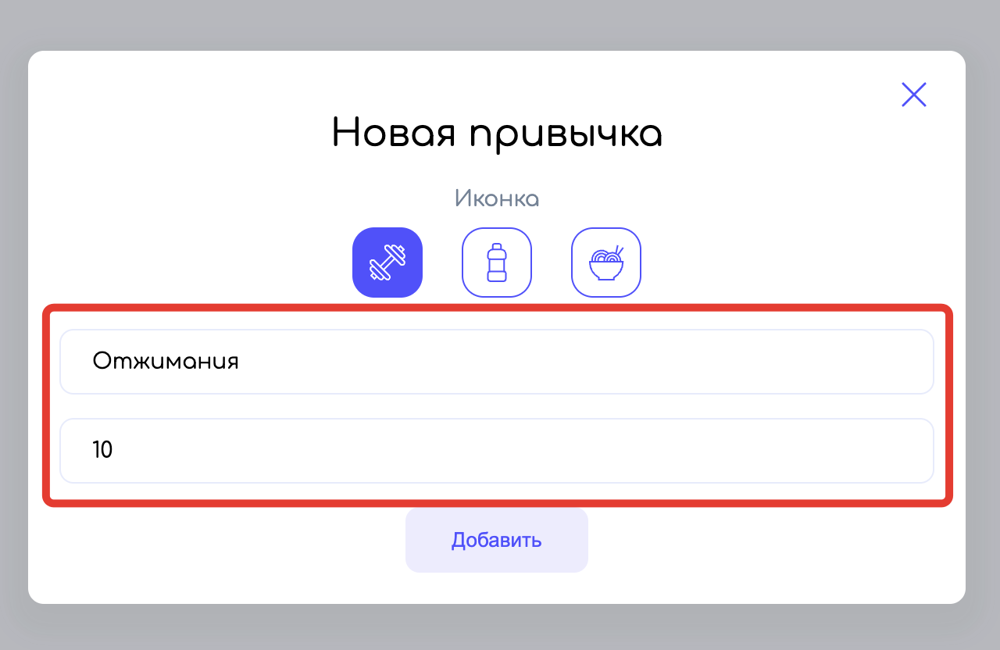
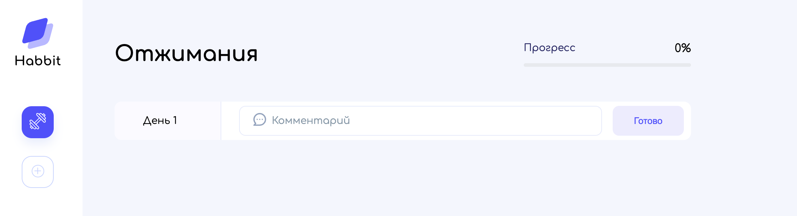

# Добавление привычки

При первом запуске приложения привычки ещё отсутствуют, меню приложения и экран просмотра привычки пустые:

Добавить новую привычку можно через специальную кнопку в левом меню приложения:

Здесь необходимо выбрать тип привычки - физические упражнение, потребление воды или правильное питание:

Указать название привычки и количество дней, необходимых для её формирования:

После создания привычки в правой части приложения будут отображены её детали:

Все данные по привычкам хранятся в **localStorage**.

[<< Запуск](../02-start/README.md) | [Просмотр привычки >>](../04-show-habbit/README.md) | [**К оглавлению**](../README.md)