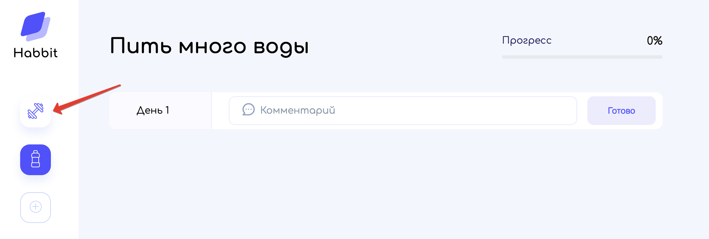
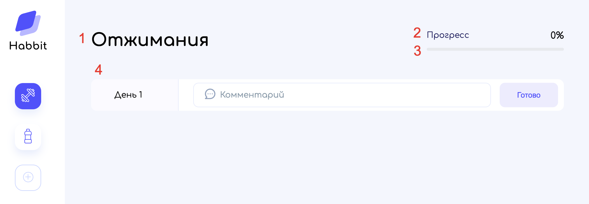

# Просмотр привычки

Попасть на страницу привычки можно после её создания или с помощью переключения в левом меню приложения:

Информация по привычке будет отображена в правой части приложения:

1) Название привычки;
2) Прогресс выполнения привычки в процентах;
3) Прогресс выполнения привычки в визуальном представлении;
4) Область добавления комментариев по привычке.

---

[<< Добавление привычки](../03-add-habbit/README.md) | [Управление комментариями привычки >>](../05-manage-habbit-comments/README.md) | [**К оглавлению**](../README.md)