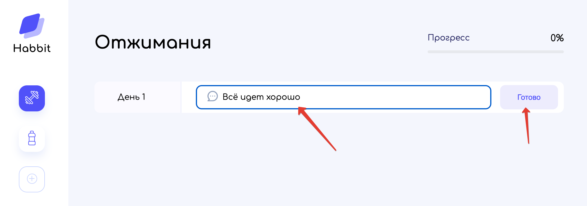
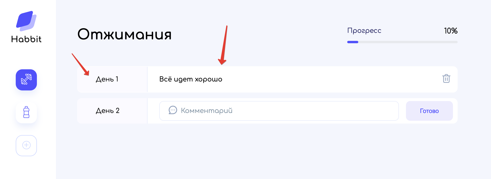
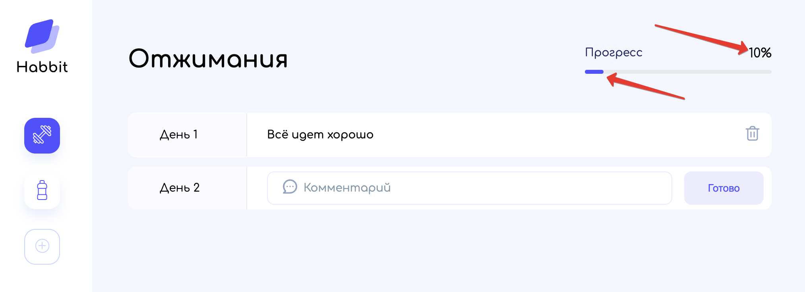
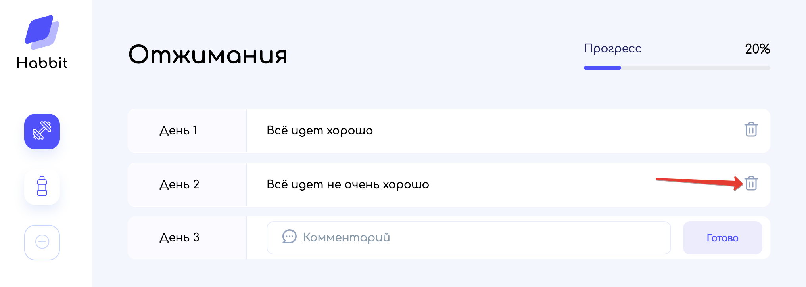

# Управление комментариями привычки

Для привычки можно добавить комментарий по прогрессу её выполнения:

Комментарий будет отображен в списке всех комментариев под цифрой соответствующего дня:

При этом прогресс привычки будет изменен в зависимости от общего количества дней достижения привычки:

Существующий комментарий также можно и удалить:

---

[<< Просмотр привычки](../04-show-habbit/README.md) | [**К оглавлению**](../README.md)
